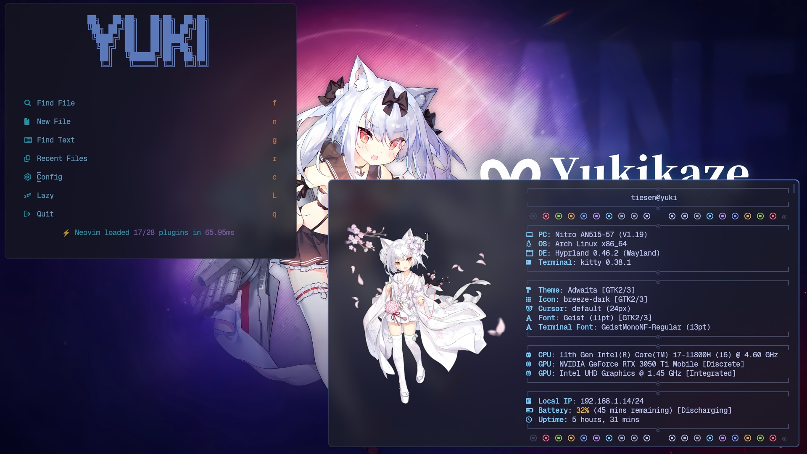

# My arch linux config with Hyprland



## Table of Contents

1. [How to install](#how-to-install)
2. [How to use](#how-to-use)
3. [How to change the themes](#how-to-change-the-themes)

## How to install

1. Clone this repository

```bash
git clone git@github.com:tiesen243/dotfiles.git ~/dotfiles
```

2. Install `yay`

```bash
pacman -S --needed git base-devel
git clone https://aur.archlinux.org/yay.git ~/yay
cd ~/yay
makepkg -si
rm -rf ~/yay
```

3. Install all dependences

```bash
sudo pacman -S zsh hypridle hyprpaper hyprlock p7zip wofi pavucontrol gvfs brightnessctl playerctl fastfetch btop cliphist wl-clipboard grim slurp lsd cowsay
sudo yay -S lazygit floorp-bin wlogout hyprpicker nwg-look yazi
```

4. If Japanese/Chinese/Korean font not display correctly

```bash
sudo pacman -S noto-fonts noto-fonts-cjk noto-fonts-emoji
```

5. Install `oh-my-zsh`

```bash
sh -c "$(curl -fsSL https://raw.githubusercontent.com/ohmyzsh/ohmyzsh/master/tools/install.sh)"
```

Then, install zsh plugins

```bash
git clone https://github.com/zsh-users/zsh-syntax-highlighting.git ${ZSH_CUSTOM:-~/.oh-my-zsh/custom}/plugins/zsh-syntax-highlighting
git clone https://github.com/zsh-users/zsh-autosuggestions ${ZSH_CUSTOM:-~/.oh-my-zsh/custom}/plugins/zsh-autosuggestions
```

5. Copy folder `~/dotfiles/zsh/theme` to `~/.oh-my-zsh/custom/themes`

```bash
cp -r ~/dotfiles/zsh/themes ~/.oh-my-zsh/custom
```

Then, change the content of `~/.zshrc` to

```bash
source ~/dotfiles/zsh/config.zsh
```

6. Optional: Install `miniconda3` for python and `nvm` for nodejs development environment

- Miniconda

```bash
mkdir -p ~/.miniconda3
wget https://repo.anaconda.com/miniconda/Miniconda3-latest-Linux-x86_64.sh -O ~/.miniconda3/miniconda.sh
bash ~/.miniconda3/miniconda.sh -b -u -p ~/.miniconda3
rm -rf ~/.miniconda3/miniconda.sh
~/.miniconda3/bin/conda init zsh
```

- NVM

```bash
curl -o- https://raw.githubusercontent.com/nvm-sh/nvm/v0.40.0/install.sh | bash
```

- If you use `bun` for default node package manager

```bash
# .zshrc

# >>> bun initialize >>>
if [ -d "$HOME/.bun/bin" ]; then
    export PATH="$HOME/.bun/bin:$PATH"
fi
# <<< nvm initialize <<<
```

## How to use

1. Change the content of `~/.config/hypr/hyprland.conf` to

```bash
source ~/dotfiles/hypr/hyprland.conf
```

2. Copy `yazi` config to `~/.config/yazi`

```bash
cp -r ~/dotfiles/yazi/yazi.toml ~/.config/yazi
```

## How to change the themes

1. Change Themes

```bash
cp -r ~/dotfiles/.fonts ~/
cp -r ~/dotfiles/.icons ~/
cp -r ~/dotfiles/.themes ~/
```

Then, you can change the themes by `nwg-look` command

2. Change Wallpaper in `~/dotfiles/hypr/hyprpaper.conf`

```bash
preload = ~/path/to/wallpaper
wallpaper = ,~/path/to/wallpaper
```

Or change file in `~/dotfiles/assets/background.png`

## Note:

- If you use `obs-studio`, you can install `wlrobs` dependency for screen recording

```bash
sudo pacman -S obs-studio
yay -S wlrobs
```

---

## Enjoy it!

Documentations: [here](https://tiesen.id.vn/blog/hyprland/)

Optional: You can try my neovim config at [here](https://github.com/tiesen243/nvim)
